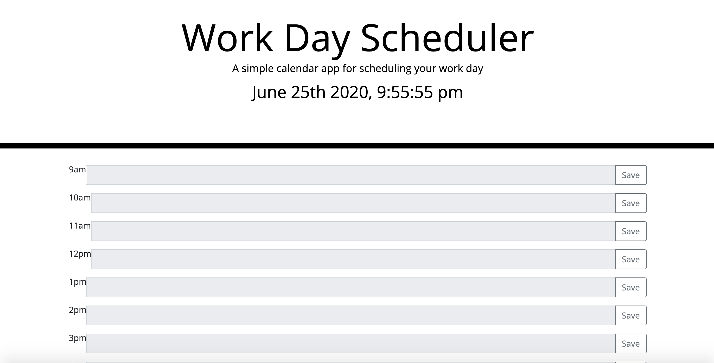

This is a Daily Scheduler that will schedule daily events. Once text it typed into a specific time slot, the data is saved in local storage. If the time slot is not past the current time then you will not be able to insert any of your daily plans because that time is in the past.
Please see below link:

https://github.com/Conchettapark/Daily-Scheduler

